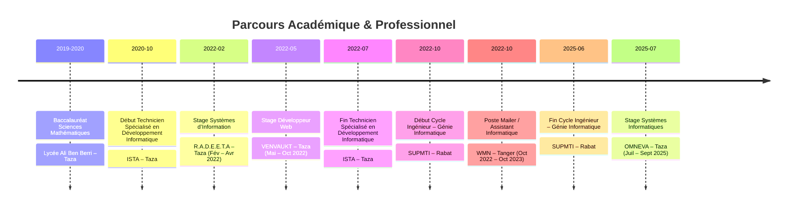

<div align="center">


<p>
  
</p>

<p>
  <a href="mailto:briouelaymane0@gmail.com">
    
  </a>
  <a href="https://www.linkedin.com/in/aymane-briouel-582540224/">
    
  </a>
  <a href="https://github.com/AYMANE777">
    
  </a>
  <a href="tel:+212658597927">
    
  </a>
</p>

</div>

---

## 👨‍💻 À Propos de Moi

<div align="center">

</div>

```javascript
const aymane = {
  identity: {
    role: "Ingénieur en Informatique",
    location: "Taza, Maroc 🇲🇦"
  },

  specialization: [
    "Systèmes d’Information",
    "Développeure Full Stack",
    "Intelligence Artificielle"
  ],

  education: {
    degree: "Cycle Ingénieur – Génie Informatique",
    school: "SUPMTI – Rabat"
  },

  expertise: [
    "Applications web performantes et sécurisées",
    "Sécurité applicative & gestion des accès",
    "Analyse de données & solutions basées sur l’IA"
  ],

  mindset: ["Rigueur", "Performance", "Innovation"],

  objective: "Créer des solutions fiables à forte valeur ajoutée"
};
```

<div align="center">  </div>
---

## Parcours Académique & Professionnel
<div align="center"> </div>


```mermaid
timeline
    title Parcours Académique & Professionnel

    2019-2020 : Baccalauréat Sciences Mathématiques
              : Lycée Ali Ben Berri – Taza

    2020-10 : Début Technicien Spécialisé en Développement Informatique
            : ISTA – Taza

    2022-02 : Stage Systèmes d’Information
            : R.A.D.E.E.T.A – Taza (Fév – Avr 2022)

    2022-05 : Stage Développeur Web
            : VENVAUKT – Taza (Mai – Oct 2022)

    2022-07 : Fin Technicien Spécialisé en Développement Informatique
            : ISTA – Taza

    2022-10 : Début Cycle Ingénieur – Génie Informatique
            : SUPMTI – Rabat

    2022-10 : Poste Mailer / Assistant Informatique
            : WMN – Tanger (Oct 2022 – Oct 2023)

    2025-06 : Fin Cycle Ingénieur – Génie Informatique
            : SUPMTI – Rabat

    2025-07 : Stage Systèmes Informatiques
            : OMNEVA – Taza (Juil – Sept 2025)
    
```
---

## Stack Technique

### Développement
<p>
  
  
  
  
  
  
</p>

### IA & Data
<p>
  
  
  
</p> 

### Bases de Données
<p>
  
  
  
  
</p> 

### Outils & Méthodes
<p>
  
  
  
  
  
  
</p>
### Frontend Development
<p>
  
  
  
  
</p>

###  Backend Development
<p>
  
  
  
  
  
</p>

### Bases de Données

<p>
  
  
  
  
</p>

### Outils & Méthodologies

<p>
  
  
  
  
  
  
</p>

### Systèmes & Virtualisation

<p>
  
  
  
  
  
</p>
---


## Langues

Arabe : Maternelle  
Français : B2  
Anglais : Intermédiaire  

---

## GitHub Stats
<div align="center">
  
  
</div>
---

<div align="center">


### Ingénierie • Performance • Innovation

</div>
